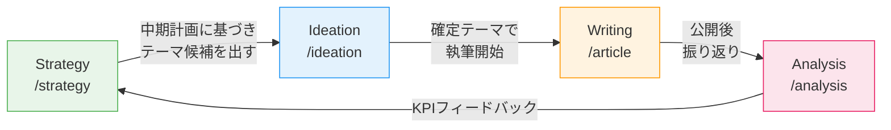

# コンテンツライフサイクル全体マップ

SidePost Buddy のコンテンツ制作は4つのフェーズで構成される。
各フェーズのスキルを順に実行し、Analysis の結果を Strategy にフィードバックして改善サイクルを回す。

## フェーズ全体図



---

## スキル一覧

### メインフェーズ

| コマンド | フェーズ | 用途 |
|---------|---------|------|
| `/strategy` | Strategy | 中期計画・KPI目標・コンテンツカレンダー策定 |
| `/ideation` | Ideation | テーマのネタ出し・評価・企画確定 |
| `/article` | Writing | 記事作成（Step 0-5）メインワークフロー |
| `/analysis` | Analysis | 公開後のパフォーマンス振り返り |

### 補助スキル

| コマンド | 用途 | 主な使用フェーズ |
|---------|------|-----------------|
| `/interview` | AIインタビューで素材引き出し | Ideation / Writing |
| `/slide` | スライド画像生成 | Writing |
| `/screenshot` | スクリーンショット加工 | Writing |
| `/review` | ペルソナレビュー単体実行 | Writing |
| `/persona` | ペルソナ会話シミュレーション | Cross |
| `/daily-note-article-items` | デイリーノートから記事素材抽出 | Ideation / Writing |

---

## 起動時の自動処理: セッション再開チェック

1. **Glob** `04_writing/01_draft/*/progress.md` で進行中の作業フォルダを検索
2. 見つかった場合:
   - 各 `progress.md` を **Read** して進捗状態を確認
   - 未完了のステップがある記事をユーザーに提示
   - 「`/article resume` で途中再開できます」と案内
3. 見つからない場合:
   - 「進行中の記事はありません」と表示

---

## 次のアクション選択

セッション再開チェックの結果を踏まえ、ユーザーに次のアクションを選んでもらう。
**AskUserQuestion** で以下の選択肢を提示する:

- **`/strategy` を実行** — 中期計画・コンテンツカレンダーの策定・見直し
- **`/ideation` を実行** — 記事テーマのネタ出し・評価・確定
- **`/article` を実行** — 記事の新規作成または途中再開
- **`/analysis` を実行** — 公開済み記事の振り返り

※ 進行中の記事が検出された場合は、`/article resume` の選択肢も含める。

---

## 典型的な流れ

### 新規に記事を書く場合

```
1. /strategy — コンテンツカレンダーを確認し、今月のテーマ方針を把握
2. /ideation — テーマ候補を出し、企画メモで評価 → テーマ確定
3. /article {テーマ名} — Step 0-5 で記事を完成・公開
4. /analysis — 公開後に振り返りシートで結果を記録
```

### 初めて使う場合（Strategy未整備）

```
1. /ideation — テーマを決めて企画メモを書く
2. /article {テーマ名} — 記事を完成・公開
3. 数本の記事が溜まったら /strategy で中期計画を立てる
4. /analysis を始めてフィードバックループを回す
```

---

## 設定ファイル

| ファイル | パス | 用途 |
|---------|------|------|
| ペルソナ定義 | `01_strategy/03_target/persona.md` | ターゲット読者の定義 |
| ブランドスクリプト | `01_strategy/04_brand/brand_script.md` | StoryBrand SB7 |
| トーン＆マナー | `00_config/concept/tone_manner.md` | 文体・表現ルール |
