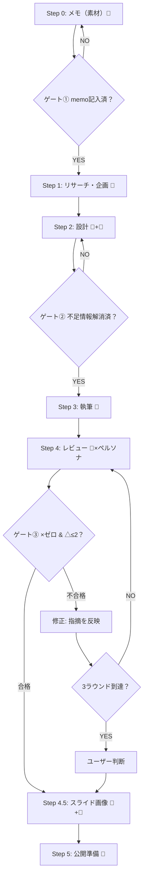

# 記事作成ワークフロー（Step 0-5）

note向けの記事をStep 0-5で完成させるメインワークフロー。

## ワークフロー全体図



---

## 起動時の処理

### 引数が `resume` の場合（途中再開）

1. **Glob** `03_writing/01_draft/*/progress.md` で進行中の作業フォルダを検索
2. 最新のフォルダの **Read** `progress.md` で現在ステップを把握
3. 未完了のステップから再開

### 引数がテーマ名の場合（新規作成）

1. **Bash**: 作業フォルダを作成
   ```bash
   mkdir -p 03_writing/01_draft/YYYYMMDD_{テーマ短縮}/image_assets
   ```
2. 以下を**並列で実行**:
   - **Read** [step0_memo.md](step0_memo.md) → **Write** 作業フォルダに `step0_memo.md` をコピー
   - **Read** スライドYAMLテンプレート（`.claude/skills/3-slide/prompt_templates/slide_image_prompts_00_rule_and_blank.yaml`）→ **Write** `image_assets/slide_image_prompts.yaml` としてコピー
3. **Write** `progress.md`（下記チェックリスト）を作業フォルダに作成
4. **TaskCreate** で全ステップのタスクを一括作成（依存関係付き）

### 進行チェックリスト（progress.md）

```markdown
# 進行チェックリスト

| # | ステップ | 状態 | 完了日 | メモ |
|---|----------|------|--------|------|
| 0 | メモ（素材） | ⬜ 未着手 / 🔵 記入中 / ✅ 完了 |  |  |
| G1 | ゲート①：memo記入済か | ⬜ 未確認 / ✅ 通過 |  |  |
| 1 | リサーチ・企画 | ⬜ 未着手 / 🔵 作業中 / ✅ 完了 |  |  |
| 2 | 設計 | ⬜ 未着手 / 🔵 作業中 / ✅ 完了 |  |  |
| G2 | ゲート②：不足情報解消済か | ⬜ 未確認 / ✅ 通過 |  |  |
| 3 | 執筆 | ⬜ 未着手 / 🔵 作業中 / ✅ 完了 |  |  |
| 4 | レビュー ラウンド1 | ⬜ 未着手 / 🔵 作業中 / ✅ 完了 |  |  |
| 4a | レビュー ラウンド2 | ⬜ 不要 / 🔵 作業中 / ✅ 完了 |  |  |
| 4b | レビュー ラウンド3 | ⬜ 不要 / 🔵 作業中 / ✅ 完了 |  |  |
| G3 | ゲート③：合格基準達成か | ⬜ 未確認 / ✅ 通過 |  |  |
| 4.5 | スライド画像作成 | ⬜ 未着手 / 🔵 作業中 / ✅ 完了 |  |  |
| 5 | 公開準備 | ⬜ 未着手 / 🔵 作業中 / ✅ 完了 |  |  |
```

---

## 各ステップ詳細

### Step 0: 執筆者メモ（素材）

**AI制約: AIが捏造しない。編集のみを実施する。**

1. ユーザーがテーマ・体験談・数字・ボイスメモ等の素材を `step0_memo.md` に記入する
2. 以降のステップでは step0 に書かれた情報のみを記事の根拠として使用する
3. step0 にない情報をAIが補完・推測・創作してはならない

**ゲート①**: memo内に「テーマ」と「体験・エピソード」が1つ以上記入されていることを確認してから次へ。未記入の場合はユーザーに記入を促す。

**ツール**: Read（step0確認）→ ゲート判定

**完了時**: TaskUpdate + Write `progress.md` 更新

### Step 1: リサーチ・企画

以下を**並列で Read**:
- 作業フォルダの `step0_memo.md`
- `01_strategy/03_target/persona.md`（ペルソナ定義）
- [step1_research.md](step1_research.md)（テンプレート）

以下を**並列で WebSearch**:
- 類似記事調査（テーマ関連キーワード）
- キーワード調査

テンプレートに沿ってリサーチ結果を整理 → **Write** `step1_research.md`

**完了時**: TaskUpdate + Write `progress.md` 更新

### Step 2: 設計

以下を**並列で Read**:
- `step0_memo.md`
- `step1_research.md`
- `01_strategy/03_target/persona.md`
- [step2_design.md](step2_design.md)（テンプレート）

1. **ペルソナ選定（必須）**: persona.md から記事テーマに最も合うペルソナを1人選び、ターゲット整理に反映
2. **目次構成を作成**
3. **不足情報の明示（必須）**: 必須レベル／あるとよいレベルに分けてチェックリスト形式で提示
4. **AskUserQuestion** で不足情報の確認・追加インプットを依頼

**Write** `step2_design.md`

**ゲート②**: 不足情報の「必須レベル」がすべて埋まっていることを確認してから Step 3 へ。

**完了時**: TaskUpdate + Write `progress.md` 更新

### Step 3: 執筆

以下を**並列で Read**:
- `step0_memo.md`
- `step2_design.md`
- `00_config/concept/tone_manner.md`
- [step3_writing.md](step3_writing.md)（テンプレート ＝ 文体ルール含む）

テンプレート内の「note記事の書き方（固定ルール）」に従って本文を執筆 → **Write** `step3_writing.md`

**完了時**: TaskUpdate + Write `progress.md` 更新

### Step 4: レビュー

以下を**並列で Read**:
- `01_strategy/03_target/persona.md`（step2で選定したペルソナのセクション）
- `00_config/concept/tone_manner.md`
- `step3_writing.md`（記事本文）
- [persona_review_prompt.md](persona_review_prompt.md)（Agent tool用プロンプト）

1. **Read** [persona_review_prompt.md](persona_review_prompt.md) でペルソナレビュー指示を取得
2. **Agent tool** でペルソナレビューを実行（subagent_type: general-purpose）
   - ペルソナ情報 + 記事本文 + トンマナを渡す
   - 5観点（共感度・理解度・納得度・行動度・信頼度）で ○/△/× 評価
3. **合格判定**: ×がゼロ かつ △が2件以下 → 合格
4. 不合格の場合:
   - **Edit** で記事を修正
   - 再レビュー（最大3ラウンド）
5. 3ラウンドで合格しない場合: 残課題をユーザーに提示

**レビューファイルのバージョン管理**:
- ラウンド1: **Write** `step4_review.md`
- ラウンド2: **Write** `step4_review_round2.md`
- ラウンド3: **Write** `step4_review_round3.md`

**ゲート③**: 合格基準を満たしていることを確認してから Step 4.5 へ。

**完了時**: TaskUpdate + Write `progress.md` 更新

### Step 4.5: スライド画像作成

`/slide` スキルと連携して画像を生成する。

1. **Read** 作業フォルダの `image_assets/slide_image_prompts.yaml` + 記事本文
2. **Edit** で YAML の各プロンプトを記事内容に合わせて更新
3. **Bash**: `.claude/skills/3-slide/scripts/slideimg.sh dry {ジョブ名}` で構文チェック
4. **Bash**: `.claude/skills/3-slide/scripts/slideimg.sh run {ジョブ名}` で生成
5. **Read**: 生成画像を確認 → ユーザーに報告

**完了時**: TaskUpdate + Write `progress.md` 更新

### Step 5: 公開準備

1. **Read** [step5_publish.md](step5_publish.md)（テンプレート）
2. テンプレートに沿って公開チェックリストを埋める → **Write** `step5_publish.md`

**完了時**: TaskUpdate + Write `progress.md` 更新（全ステップ完了）

---

## 作業フォルダ構成

```
03_writing/01_draft/YYYYMMDD_{テーマ短縮}/
├── image_assets/
│   └── slide_image_prompts.yaml
├── progress.md
├── step0_memo.md
├── step1_research.md
├── step2_design.md
├── step3_writing.md
├── step4_review.md
├── step4_review_round2.md（必要な場合）
├── step4_review_round3.md（必要な場合）
└── step5_publish.md
```

---

## 設定ファイル参照先

| ファイル | パス | 用途 |
|---------|------|------|
| ペルソナ定義 | `01_strategy/03_target/persona.md` | Step 2 ターゲット選定、Step 4 レビュー |
| トーン＆マナー | `00_config/concept/tone_manner.md` | Step 3 文体確認、Step 4 トンマナチェック |
| ブランドスクリプト | `01_strategy/04_brand/brand_script.md` | 必要に応じて参照 |

---

## 関連スキル

- `/interview` — テーマが漠然としている場合の前段プロセス（Step 0 素材引き出し）
- `/slide` — Step 4.5 のスライド画像作成
- `/review` — Step 4 のペルソナレビューを単体実行
- `/persona` — ペルソナ会話シミュレーション
