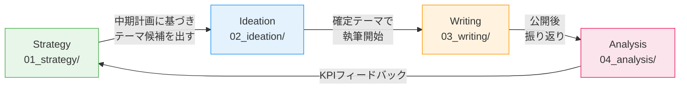

# コンテンツライフサイクル全体マップ

SidePost Buddy のコンテンツ制作は、4つのフェーズで構成される。
各フェーズのワークフローを順に実行し、Analysis の結果を Strategy にフィードバックすることで改善サイクルを回す。

---

## フェーズ全体図



---

## フェーズ一覧

| # | フェーズ | ディレクトリ | ワークフロー | 役割 |
|---|---------|-------------|-------------|------|
| 1 | Strategy | `01_strategy/` | `09_strategy.md` | 中期計画・コンテンツカレンダー・KPI目標の策定 |
| 2 | Ideation | `02_ideation/` | `07_planning.md` | 個別記事のネタ出し・テーマ評価・企画確定 |
| 3 | Writing | `03_writing/` | `01_article_creation.md` | 素材収集 → 執筆（Step 0-5） |
| 4 | Analysis | `04_analysis/` | `08_post_analysis.md` | 公開後の振り返り・パフォーマンス分析 |

---

## 補助ワークフロー

メインフェーズとは独立して、必要に応じて使用する補助ワークフロー。

| ワークフロー | ファイル | 用途 | 主な使用フェーズ |
|-------------|---------|------|-----------------|
| AIインタビュー | `02_ai_interview.md` | テーマが漠然としている場合の素材引き出し | Ideation / Writing |
| スクリーンショット加工 | `03_screenshot_privacy.md` | 画像のプライバシー保護 | Writing |
| スライド画像作成 | `04_slide_generation.md` | 記事用スライド画像の生成 | Writing |
| ペルソナ会話 | `05_persona_roleplay.md` | ペルソナロールプレイでコンテンツ検証 | Ideation / Writing |
| 戦略会議 | `06_strategy_council.md` | マルチAI戦略会議（準備中） | Strategy |

---

## 典型的な流れ

### 新規に記事を書く場合

```
1. Strategy: コンテンツカレンダーを確認し、今月のテーマ方針を把握
2. Ideation: テーマ候補を出し、企画メモで評価 → テーマ確定
3. Writing:  Step 0-5 で記事を完成・公開
4. Analysis: 公開後に振り返りシートで結果を記録
```

### 初めて使う場合（Strategy未整備）

```
1. Ideation から開始（テーマを決めて企画メモを書く）
2. Writing で記事を完成・公開
3. 数本の記事が溜まったら Strategy で中期計画を立てる
4. Analysis を始めてフィードバックループを回す
```

---

## 設定ファイル

| ファイル | パス | 用途 |
|---------|------|------|
| ペルソナ定義 | `00_config/concept/persona.md` | ターゲット読者の定義 |
| ブランドスクリプト | `00_config/concept/brand_script.md` | StoryBrand SB7 |
| トーン＆マナー | `00_config/concept/tone_manner.md` | 文体・表現ルール |

## テンプレート

| テンプレート | パス | 用途 |
|-------------|------|------|
| Step 0-5 | `00_config/template/step0_memo.md` 〜 `step5_publish.md` | Writing 各ステップ |
| 企画メモ | `00_config/template/planning_memo.md` | Ideation テーマ評価 |
| 振り返りシート | `00_config/template/analysis_sheet.md` | Analysis 記事振り返り |
| 中期計画シート | `00_config/template/strategy_sheet.md` | Strategy 計画策定 |
