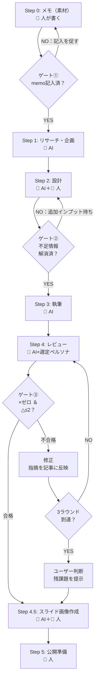

# 記事作成ワークフロー（AIに渡す用）

このファイルは「note向けの記事」をAIと一緒に作るための手順書です。
各ステップで使うテンプレートは `00_config/template/` 配下のファイルを参照してください（このファイル内にテンプレ本文は持ちません）。

作業は必ず `03_writing/01_draft/` 配下にフォルダを作成して、その中で行ってください。各ステップのアウトプットもすべてそのフォルダに保管します。

## ワークフロー全体図



---

## 進行チェックリスト

AIは各ステップの開始・完了時にこのチェックリストを更新すること。
作業フォルダ内に `progress.md` としてコピーし、進捗を記録する。

```markdown
# 進行チェックリスト

| # | ステップ | 状態 | 完了日 | メモ |
|---|----------|------|--------|------|
| 0 | メモ（素材） | ⬜ 未着手 / 🔵 記入中 / ✅ 完了 |  |  |
| G1 | ゲート①：memo記入済か | ⬜ 未確認 / ✅ 通過 |  |  |
| 1 | リサーチ・企画 | ⬜ 未着手 / 🔵 作業中 / ✅ 完了 |  |  |
| 2 | 設計 | ⬜ 未着手 / 🔵 作業中 / ✅ 完了 |  |  |
| G2 | ゲート②：不足情報解消済か | ⬜ 未確認 / ✅ 通過 |  |  |
| 3 | 執筆 | ⬜ 未着手 / 🔵 作業中 / ✅ 完了 |  |  |
| 4 | レビュー ラウンド1 | ⬜ 未着手 / 🔵 作業中 / ✅ 完了 |  |  |
| 4a | レビュー ラウンド2 | ⬜ 不要 / 🔵 作業中 / ✅ 完了 |  |  |
| 4b | レビュー ラウンド3 | ⬜ 不要 / 🔵 作業中 / ✅ 完了 |  |  |
| G3 | ゲート③：合格基準達成か | ⬜ 未確認 / ✅ 通過 |  |  |
| 4.5 | スライド画像作成 | ⬜ 未着手 / 🔵 作業中 / ✅ 完了 |  |  |
| 5 | 公開準備 | ⬜ 未着手 / 🔵 作業中 / ✅ 完了 |  |  |
```

### 運用ルール
- ステップ開始時に状態を「🔵 作業中」に変更する
- ステップ完了時に状態を「✅ 完了」に変更し、完了日を記入する
- ゲートは条件を満たしたら「✅ 通過」に変更する。条件未達なら次ステップに進まない
- 途中再開時は、まずこのチェックリストを確認して現在地を把握する

---

## 使い方（AIへの指示）

あなたは編集アシスタントです。以下のルールと手順に従って、note記事を完成させてください。

### 作業場所（必須）
最初に、`03_writing/01_draft/` 配下に今回の記事用の作業フォルダを作成してください。

推奨の命名例:
- `03_writing/01_draft/YYYYMMDD_{テーマ短縮}/`

作業フォルダ内で、テンプレートをコピーして順に埋め、各ステップの成果物を保存してください（テンプレ側は編集しない）。

#### ディレクトリ作成時の初期化（必須）
作業フォルダを作成したら、以下も同時に行うこと:
1. `image_assets/` サブフォルダを作成
2. `00_config/template/prompt_templates/slide_image_prompts_00_rule_and_blank.yaml` を `image_assets/slide_image_prompts.yaml` としてコピー（初期化）

```
03_writing/01_draft/YYYYMMDD_{テーマ短縮}/
├── image_assets/
│   └── slide_image_prompts.yaml   ← ブランクテンプレから初期化
├── progress.md
├── step0_memo.md
├── ...
```

※ スライド画像の生成手順は `00_config/workflow/04_slide_generation.md` を参照

保存するファイル名例:
- `progress.md`（進行チェックリスト）
- `image_assets/slide_image_prompts.yaml`（スライド画像プロンプト）
- `step0_memo.md`
- `step1_research.md`
- `step2_design.md`
- `step3_writing.md`
- `step4_review.md`（ラウンド1）
- `step4_review_round2.md`（ラウンド2、必要な場合）
- `step4_review_round3.md`（ラウンド3、必要な場合）
- `step5_publish.md`

### 途中再開の場合
ワークフローを途中から再開する場合は、`03_writing/01_draft/` 配下の作業フォルダを確認する。

1. 最新の作業フォルダ（例: `20260201_coding_agent/`）を特定
2. `progress.md` を読んで現在のステップを把握する
3. 未完了のステップから作業を再開し、`progress.md` を更新する

---
## 作成ステップ詳細

### Step 0: 執筆者メモ（素材）
- テンプレート: `00_config/template/step0_memo.md`
- **AIが捏造しない。編集のみを実施する。** 執筆者がテーマ、体験談、数字、ボイスメモ等の素材を記入する
- 以降のステップ（step1〜step5）では、step0に書かれた情報のみを記事の根拠として使用する。step0にない情報をAIが補完・推測・創作してはならない（ハルシネーション防止）
- step0が空または未作成の場合、AIはstep1に進まず、まずユーザーにメモの記入を促すこと
- デイリーノートなどからmemoへ情報を移す場合がある
- **ゲート①**: memo内に「テーマ」と「体験・エピソード」が1つ以上記入されていることを確認してから次へ進む

### Step 1: リサーチ・企画
- テンプレート: `00_config/template/step1_research.md`
- step0の内容を前提として、類似記事調査やキーワード調査を行う

### Step 2: 設計
- テンプレート: `00_config/template/step2_design.md`
- **ペルソナの選定（必須）**: `00_config/concept/persona.md` から記事テーマに最も合うペルソナを1人選び、ターゲット整理に反映する。必要に応じて記事テーマに合わせて微調整する。
- **不足情報の明示（必須）**: 目次構成を作成した後、記事の説得力・具体性を高めるために追加で必要な情報を洗い出し、「不足している情報」セクションとしてstep2内に記載する。必須レベル／あるとよいレベルに分けてチェックリスト形式で示し、ユーザーが追加のボイスメモ等でインプットできるようにする。
- **ゲート②**: 不足情報の「必須レベル」がすべて埋まっていることを確認してからstep3へ進む

### Step 3: 執筆
- テンプレート: `00_config/template/step3_writing.md`
- 本文の固定ルール（文体・構成）はstep3テンプレート内の「note記事の書き方（固定ルール）」に従う

### Step 4: レビュー
- テンプレート: `00_config/template/step4_review.md`
- **step2で選定した1人のペルソナ**でsubagentを実行し、読者目線でレビューさせる（ターゲットペルソナのみ）
- **合格基準**: ①×（要修正）がゼロ ②△が2件以下（5観点中）
- 不合格の場合、指摘を修正して再レビュー（最大3ラウンド）
- 3ラウンドで合格しない場合は、残課題を記録しユーザー判断を仰ぐ
- **レビューファイルのバージョン管理**: ラウンドごとに別ファイルで管理する
  - ラウンド1: `step4_review.md`
  - ラウンド2: `step4_review_round2.md`
  - ラウンド3: `step4_review_round3.md`
  - 各ファイルにはそのラウンドのレビュー結果・合格判定・修正対応を記録する
- **ゲート③**: 合格基準を満たしていることを確認してからstep4.5へ進む

### Step 4.5: スライド画像作成
- 参照: `00_config/workflow/04_slide_generation.md`
- レビュー完了後（ゲート③通過またはユーザー判断後）、記事の内容に合わせてスライド画像を作成する
- **手順:**
  1. 作業フォルダの `image_assets/slide_image_prompts.yaml` を記事内容に合わせて編集する
     - 各スライド（cover / problem / solution / closing 等）の `prompt` を、記事の各セクションに対応した内容に書き換える
     - step2の「画像の配置計画」がある場合はそれに従う
  2. `slideimg dry <ジョブ名>` で構文チェック（任意）
  3. `slideimg run <ジョブ名>` で画像を一括生成
  4. 生成結果を確認し、必要に応じてYAMLを調整して再生成する
  5. 高品質版が必要な場合は `slideimg pro <ジョブ名>` を使用する
- **成果物:** `image_assets/` 配下に生成画像が保存される
- 画像の確認・微調整はユーザーが行う（AIはYAML編集とコマンド実行を担当）

### Step 5: 公開準備
- テンプレート: `00_config/template/step5_publish.md`

---

## テンプレート参照先

| ステップ   | ファイル                         |
| ------ | ---------------------------- |
| Step 0 | `00_config/template/step0_memo.md`     |
| Step 1 | `00_config/template/step1_research.md` |
| Step 2 | `00_config/template/step2_design.md`   |
| Step 3 | `00_config/template/step3_writing.md`  |
| Step 4 | `00_config/template/step4_review.md`   |
| Step 5 | `00_config/template/step5_publish.md`  |

※ パスはすべてプロジェクトルートからの相対パス

## 設定ファイル参照先

| ファイル                     | 用途                        |
| ------------------------ | ------------------------- |
| `00_config/concept/persona.md`     | step2のターゲット選定、step4のレビュー（選定ペルソナのみ使用）  |
| `00_config/concept/tone_manner.md` | step3の文体確認、step4のトンマナチェック |
